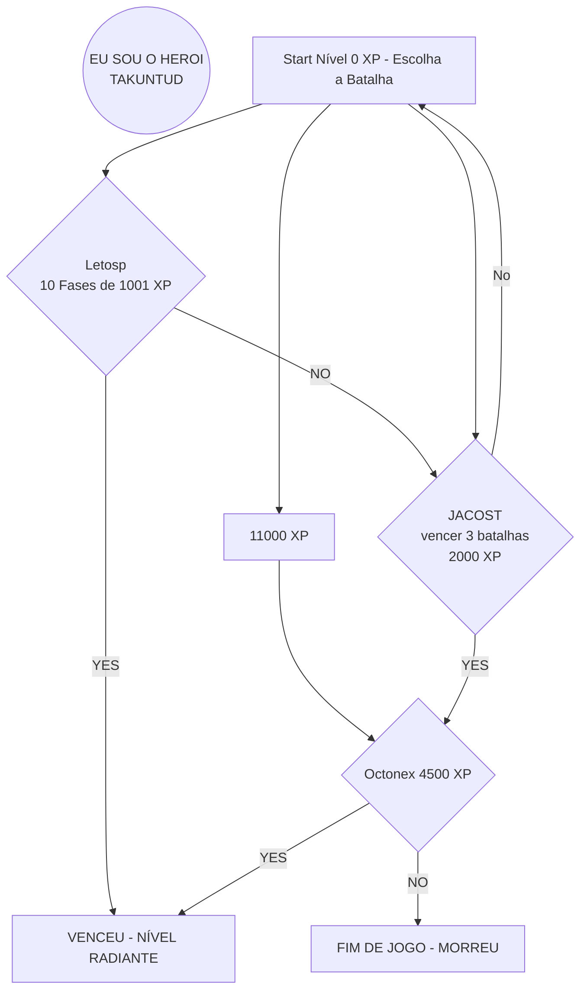

<h1>
    <a href="https://tenhaexito.blogspot.com/2024/03/imagens-projetos-dio.html">
     </ a>
    Formação Lógica de Programação
</h1>

## Objetivo 🎯
 ***No meu caso*** - Rever conceitos básicos e novidades sobre lógica de programação.

## Ferramentas 🛠️

 

---
# 1️⃣ Desafio Classificador de nível de Herói

**O Que deve ser utilizado**

- Variáveis
- Operadores
- Laços de repetição
- Estruturas de decisões

## Objetivo

Crie uma variável para armazenar o nome e a quantidade de experiência (XP) de um herói, depois utilize uma estrutura de decisão para apresentar alguma das mensagens abaixo:

- Se XP for menor do que 1.000 = Ferro
- Se XP for entre 1.001 e 2.000 = Bronze
- Se XP for entre 2.001 e 5.000 = Prata
- Se XP for entre 5.001 e 7.000 = Ouro
- Se XP for entre 7.001 e 8.000 = Platina
- Se XP for entre 8.001 e 9.000 = Ascendente
- Se XP for entre 9.001 e 10.000= Imortal
- Se XP for maior ou igual a 10.001 = Radiante

## Saída

Ao final deve se exibir uma mensagem:
"O Herói de nome **{nome}** está no nível de **{nivel}**"😊💙.

## O PROGRAMA
> - Esta no arquivo **prog.js**
