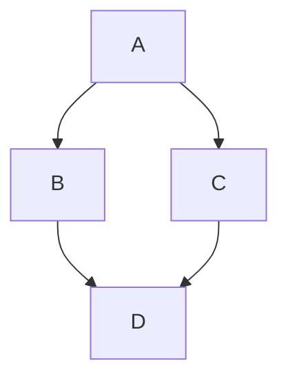
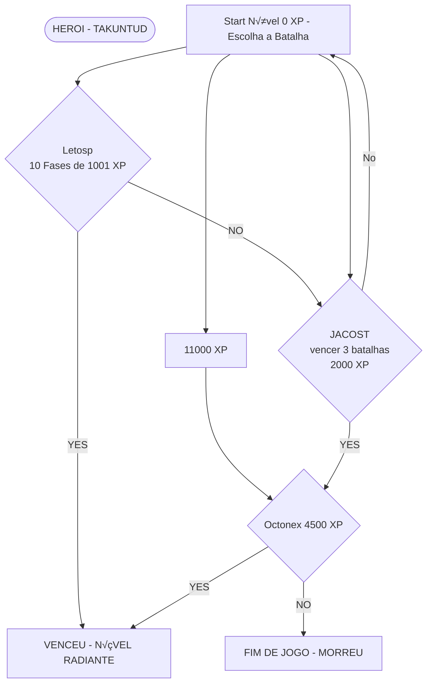

<h1>
    <a href="https://tenhaexito.blogspot.com/2024/03/imagens-projetos-dio.html">
     </ a>
    Formação Lógica de Programação
</h1>

```mermaid
graph TD;
    A-->B;
    A-->C;
    B-->D;
    C-->D;
```

```mermaid
flowchart TD;
    Z([HEROI - TAKUNTUD]);
    A[Start Nível 0 XP - Escolha a Batalha]
    A --> B{Letospüëæ
 10 Fases de 1001 xp} -- YES --> H[VENCEU - NÍVEL RADIANTE];
    A --> X[11000 XP] --> G
B{Letosp 
 10 Fases de 1001 XP} -- NO --> C{JACOST
 vencer 3 batalhas
 2000XP };
    A --> C{JACOST
 vencer 3 batalhas
 2000 XP };
   C{JACOST
 vencer 3 batalhas
 2000 XP } -- No --> A;
     C{JACOST
 vencer 3 batalhas 
2000 XP } -- YES--> G{Octonex  4500 XP};
    G -- YES --> H[VENCEU - NÍVEL RADIANTE];
    G -- NO --> J[FIM DE JOGO - MORREU];
```  
## Objetivo 🎯
 ***No meu caso*** - Rever conceitos básicos e novidades sobre lógica de programação.

## Ferramentas 🛠️

 

## Percurso
<table>
  <thead>
    <tr align="left">
      <th>Nº</th>
      <th>Etapas</th>
      <th>Materiais de Apoio</th>
    </tr>
  </thead>
  <tbody align="left">
    <tr>
      <td>01</td>
      <td>Introdução ao Lab</td>
      <td align="center">
        
      </td>
    </tr>
    <tr>
      <td>02</td>
      <td>Formas de Contribuir num Projeto Open Source</td>
      <td align="center">
        
      </td>
    </tr>
    <tr>
      <td>03</td>
      <td>Desenvolvendo e Enviando uma Contribuição</td>
      <td align="center">
        
      </td>    
    </tr>
    <tr>
      <td>04</td>
      <td>Dicas e Materiais de Apoio</td>
      <td align="center">
        
      </td>    
    </tr>
  </tbody>
  <tfoot></tfoot>
</table>

---
##  Desafio: Classificador de Nível de Herói

 
# 1️⃣ Desafio Classificador de nível de Herói

**O Que deve ser utilizado**

- Vari√°veis
- Operadores
- Laços de repetição
- Estruturas de decisões

## Objetivo

Crie uma variável para armazenar o nome e a quantidade de experiência (XP) de um herói, depois utilize uma estrutura de decisão para apresentar alguma das mensagens abaixo:

Se XP for menor do que 1.000 = Ferro
Se XP for entre 1.001 e 2.000 = Bronze
Se XP for entre 2.001 e 5.000 = Prata
Se XP for entre 5.001 e 7.000 = Ouro
Se XP for entre 7.001 e 8.000 = Platina
Se XP for entre 8.001 e 9.000 = Ascendente
Se XP for entre 9.001 e 10.000= Imortal
Se XP for maior ou igual a 10.001 = Radiante

## Saída

Ao final deve se exibir uma mensagem:
"O Herói de nome **{nome}** está no nível de **{nivel}**"😊💙.

### Instruções (PT/BR) 
1. Faça um **Fork** deste repositório;
2. Clone localmente: `git clone https://github.com/SEU_USERNAME/dio-lab-open-source.git`;
3. Adicione o remote upstream para manter seu repositório local atualizado. Por exemplo: `git remote add upstream https://github.com/digitalinnovationone/dio-lab-open-source.git`;
    > Utilize o comando `git pull upstream main` para baixar e mesclar as alterações no seu repositório local com base na branch `main` deste repositório original de onde você fez o fork, ou `git fetch upstream main` para baixar sem mesclar. Veja mais em: [Primeiros Passos com Git e GitHub](https://github.com/digitalinnovationone/dio-curso-git-github/blob/main/materiais-de-apoio/03-primeiros-passos-com-git-e-github.md).
4. Crie/Referêncie uma nova **branch** e nomeie como `feat/community/SEU_USERNAME`: `git checkout -b feat/community/SEU_USERNAME`;
    > Exemplo: `git checkout -b feat/community/rafaelscordeiro`
5. Dentro da pasta [`community`](https://github.com/digitalinnovationone/dio-lab-open-source/tree/main/community), crie um arquivo em Markdown (extens√£o `.md`) e nomeie com o mesmo nome do seu usu√°rio no GitHub;
    > Exemplo: `rafaeldscordeiro.md`  
6. Desenvolva o seu perfil. Para isso, você pode ver exemplos na pasta [`community`](https://github.com/digitalinnovationone/dio-lab-open-source/tree/main/community) e adicionar alguns dos utilitários presentes na pasta [`utils`](https://github.com/digitalinnovationone/dio-lab-open-source/tree/main/utils);
    > **Observação:** Use os outros exemplos como inspiração e não cópia.
7. Adicione suas alterações a "staging area" com o comando `git add community/SEU_USERNAME.md`;
8. Crie um commit e adicione a mensagem indicando a adição do seu perfil `git commit -m"feat: add SEU_USERNAME profile"`;
9. Envie as alterações para o seu repositório remoto `git push origin feat/community/SEU_USERNAME`; 
10. Crie um **Pull Request**.

### Instructions (EN/US)
1. **Fork** this repository;
2. Clone locally: `git clone https://github.com/YOUR_USERNAME/dio-lab-open-source.git`;
3. Add the upstream remote to keep your local repository updated. For instance: `git remote add upstream https://github.com/digitalinnovationone/dio-lab-open-source.git`;
    > Use the command `git pull upstream main` to download and merge the changes in your local repository based on the `main` branch of this original repository from which you forked, or `git fetch upstream main` to download without merging. Learn more at: [Getting Started with Git and GitHub](https://github.com/digitalinnovationone/dio-curso-git-github/blob/main/materiais-de-apoio/03-primeiros-passos-com-git-e-github.md).
4. Create/Reference a new **branch** and name it `feat/community/YOUR_USERNAME`: `git checkout -b feat/community/YOUR_USERNAME`;
    > Example: `git checkout -b feat/community/rafaeldscordeiro`
5. Inside the [`community`](https://github.com/digitalinnovationone/dio-lab-open-source/tree/main/community) folder, create a Markdown file (extension `.md`) and name it after your GitHub username;
    > Example: `rafaeldscordeiro.md`  
6. Develop your profile: For that, you can see examples in the [`community`](https://github.com/digitalinnovationone/dio-lab-open-source/tree/main/community) folder and add some of the utilities available in the [`utils`](https://github.com/digitalinnovationone/dio-lab-open-source/tree/main/utils) folder;
    > **Note:** Use the other examples as inspiration, not as a copy.
7. Add your changes to the "staging area" with the command `git add community/YOUR_USERNAME.md`;
8. Create a commit and add a message indicating the addition of your profile `git commit -m"feat: add YOUR_USERNAME profile"`;
9. Push the changes to your remote repository `git push origin feat/community/YOUR_USERNAME`;
10. Create a **Pull Request**.

### Instrucciones (ES/ES)
1. Haz un **Fork** de este repositorio;
2. Clona localmente: `git clone https://github.com/TU_USERNAME/dio-lab-open-source.git`;
3. Añade el remote upstream para mantener tu repositorio local actualizado. Por ejemplo: `git remote add upstream https://github.com/digitalinnovationone/dio-lab-open-source.git`;
    > Usa el comando `git pull upstream main` para descargar y fusionar los cambios en tu repositorio local basado en la rama `main` de este repositorio original del cual hiciste el fork, o `git fetch upstream main` para descargar sin fusionar. Aprende m√°s en: [Primeros Pasos con Git y GitHub](https://github.com/digitalinnovationone/dio-curso-git-github/blob/main/materiais-de-apoio/03-primeiros-passos-com-git-e-github.md).
4. Crea/Referencia una nueva **branch** y nómbrala `feat/community/TU_USERNAME`: `git checkout -b feat/community/TU_USERNAME`;
    > Ejemplo: `git checkout -b feat/community/rafaeldscordeiro`
5. Dentro de la carpeta [`community`](https://github.com/digitalinnovationone/dio-lab-open-source/tree/main/community), crea un archivo en Markdown (extensión `.md`) y nómbralo con el mismo nombre de tu usuario en GitHub;
    > Ejemplo: `rafaeldscordeiro.md`  
6. Desarrolla tu perfil. Para eso, puedes ver ejemplos en la carpeta [`community`](https://github.com/digitalinnovationone/dio-lab-open-source/tree/main/community) y añadir algunas de las utilidades presentes en la carpeta [`utils`](https://github.com/digitalinnovationone/dio-lab-open-source/tree/main/utils);
    > **Nota:** Usa los otros ejemplos como inspiración y no como copia.
7. Agrega tus cambios al "área de preparación" con el comando `git add community/TU_USERNAME.md`;
8. Crea un commit y añade un mensaje indicando la adición de tu perfil `git commit -m"feat: add TU_USERNAME profile"`;
9. Envía los cambios a tu repositorio remoto `git push origin feat/community/TU_USERNAME`;
10. Crea un **Pull Request**.

### Utilit√°rios

---

## Contribua

 Este é um projeto feito para a comunidade, então sinta-se livre para contribuir. Algumas formas de contribuição além do seu exemplo de Profile README, é inserir outros utilitários na pasta [`utils`](https://github.com/elidianaandrade/dio-lab-open-source/tree/main/utils), ou melhorar a página de pesquisa dos READMEs fazendo modificações nos arquivos da pasta [`docs`](https://github.com/elidianaandrade/dio-lab-open-source/tree/main/docs).  
 Além disso, você também pode contribuir:
 
⚠️ Resolvendo, respondendo ou indicando **issues**

⭐ Adicionando aos favoritos (**star**) 

### Membros da comunidade que j√° contribuiram:

##

Feito com üíô por <a href="https://github.com/elidianaandrade">Eli</a>.

